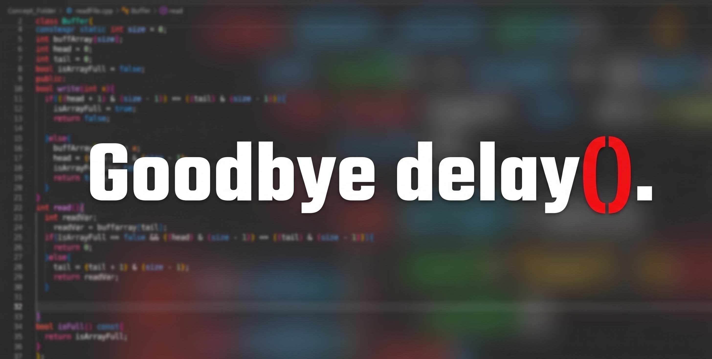

# Embedded Systems Roadmap

## Goal

Become employable as a Junior Embedded/Firmware Engineer by building one production-quality firmware project over six weeks.

---

## About This Repository

This repository documents my six-week journey into professional embedded systems and firmware development.

Rather than building multiple unrelated projects, I am developing one firmware project that evolves throughout the roadmap—from simple embedded C++ foundations to a complete Industrial IoT node using ESP32, FreeRTOS and ESP-IDF.

Every milestone builds upon the previous one.

---

## Technologies

- Modern C++
- ESP32
- Arduino IDE (Temporary)
- FreeRTOS
- ESP-IDF
- Git
- GitHub
- I²C
- SPI
- UART
- MQTT
- OTA Updates

---

## Roadmap

- [ ] Milestone 1 — Embedded C++ Foundations
- [ ] Milestone 2 — Hardware Communication
- [ ] Milestone 3 — Driver Development
- [ ] Milestone 4 — Firmware Architecture
- [ ] Milestone 5 — Professional Firmware Practices
- [ ] Milestone 6 — FreeRTOS
- [ ] Milestone 7 — ESP-IDF
- [ ] Milestone 8 — Networking & Industrial IoT

---

## Repository Structure

```
docs/
notes/
src/
```

More folders will be added as the project evolves.

---

## Engineering Journal

Throughout this roadmap I will document:

- Daily progress
- Design decisions
- Bugs encountered
- Debugging process
- Lessons learned
- Future improvements

---

## Weekly Videos

I will publish two progress videos every week documenting my learning journey, project evolution, and technical challenges.

### Week 1: Climbing the Embedded Ladder
[](https://youtu.be/4rOoZHeShZc)

---

## Final Goal

By the end of this roadmap I aim to have:

- A production-quality firmware repository
- Professional documentation
- Clean Git history
- Technical write-ups
- Architecture diagrams
- Demo videos
- A portfolio suitable for junior embedded firmware internships
