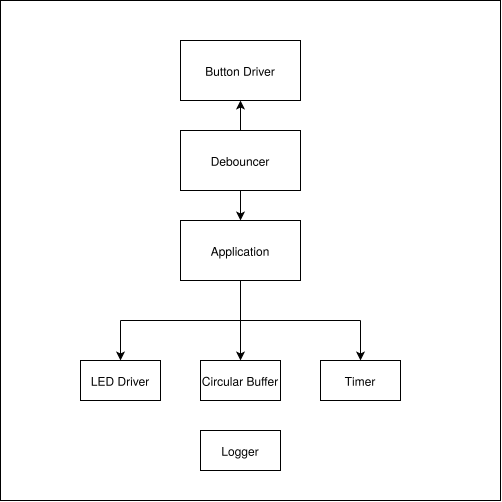

# Milestone 1 — Embedded C++ Foundations

Five small classes, built day by day, each one adding a new C++ concept on top of the last. Tested entirely in Wokwi / Serial Monitor — no physical hardware yet.

---

###### Embedded Utility Library

**What it is:**
A combined reusable library containing the components developed throughout Milestone 1.

**Components:**
- LED
- Button
- Debouncer
- Timer
- Circular Buffer
- Logger

**Structure:**


**Usage:**
```cpp
LED embedLED(8);
Button embedButton(7);
Debouncer embedDebounce(embedButton);
Timer embedTimer;
Buffer embedBuffer;
void setup(){
embedLED.begin();
embedButton.begin();
Serial.begin(9600);
embedTimer.setTimer(300);
embedTimer.reset();
}
bool buttonPressed = true;
void loop(){
if(embedDebounce.fall()){
if(buttonPressed){
  embedTimer.reset();
  buttonPressed = false;
  embedLED.on();
  embedBuffer.write(1);
}
  if(embedTimer.intervalPassed()){
    if(embedLED.ledState()){
    embedLED.off();
    embedBuffer.write(0);  
    }else{
      embedLED.on();
      embedBuffer.write(1);
    }
  }
}else{
  embedLED.off();
  buttonPressed = true;
}
}
```
**Known Limitations:** The file contains the main code of all the components involved. Which will change when the .ino files are converted to .cpp and .h files in milestone 4.


# Milestone 2 — Hardware Communication
Four communication protocols, built day by day. These will be the foundations which the drivers will rely upon. ested entirely in Wokwi / Serial Monitor — no physical hardware yet.

---

## Day 1 - UART Echo Communication Protocol Practice

**What it is:**
A function demonstrating UART protocol and data exchange between the board and the serial monitor.

**Public API**

- `Serial.begin()` — configures the UART hardware's timing.
- `Serial.available()` — returns the amount of valid bytes sitting in the recieving RX buffer.
- `Serial.read()` — returns in ASCII value, the first valid byte in the RX buffer (). It returns -1 when the buffer is empty.
- `Serial.print(x)` — sends the parameter from the TX buffer to the serial monitor.

**Usage**

```cpp
void setup(){
Serial.begin(9600);
}
char incomingString;
void loop(){
if(Serial.available()){
  incomingString = Serial.read();
  Serial.print(incomingString);
  if(incomingString == '\n'){
    Serial.println();
  }
}
}
```
**Known limitations:** UART has a lower transfer than modern communication protocols (I2C, SPI).

---

## Day 2 — Datasheet Reading & Bit Manipulation

**What it is:** Not a driver — this was a research and skill-building exercise: locating a real register in a sensor's datasheet, and separately practicing the bitwise operations needed to work with register values correctly.

**Findings**

- Sensor: MPU6050
- Register: WHO_AM_I
- Address: 0x75
- Expected value: 0x68

**Bit manipulation practice**

Practiced check/set/clear operations on a simulated register value (0x68), using a bitmask and AND/OR/AND-NOT — confirming bit 5 was set, then demonstrating that OR unconditionally sets a bit (no change, since it was already 1) and AND-with-complement clears it while leaving every other bit untouched.

```cpp
uint8_t registerVal = 0x68;
uint8_t bitMask = 1 << 5;
uint8_t readBit = registerVal & bitMask;        // check
uint8_t convertOne = registerVal | bitMask;      // set
uint8_t convertZero = registerVal & ~bitMask;    // clear
```

**Known limitations:** This is preparation work, not yet connected to real hardware — the WHO_AM_I register hasn't actually been read over I2C yet; that's Day 3.

---

## Day 3 - I2C Communication Protocol Practice
**What it is:** Not a driver - this was a skill-building exercise: mapping out the i2c arduino based functions and i2c communication protocol architecture in my head and practicing it on a dummy WHO_AM_I register.

**Findings**

- Sensor: MPU6050
- Register: WHO_AM_I
- Address: 0x75
- Expected value: 0x68

**I2C Protocol practice**

Practiced Wire functions on the dummy WHO_AM_I register of the mpu address. stating the mpu sensor address and establishing the master-slave connection. sending the dummy WHO_AM_I register address and reading the value from it.

```cpp
#include <Wire.h>
void setup(){
Serial.begin(9600);
Wire.begin();
int mpuRegister = 0x75;
int mpuAddress = 0x68;
int consoleOutput;
Wire.beginTransmission(mpuAddress);
Wire.write(mpuRegister);
Wire.endTransmission(true);
Wire.requestFrom(mpuAddress, 1);
consoleOutput = Wire.read();
Serial.print(consoleOutput, HEX);
}
void loop(){
}
```
**Known limitations:** This is practice work and hasn't been tested on real hardware. It is also using arduino based functions instead of the esp idf functions. Which will come later in the roadmap.

---

## Day 4 - SPI COmmunication Protocol Practice
**What it is:** Not a driver - this is a skill-building exercise: understanding the arduino based spi functions and how to apply them to a bmp280 sensor due to spi not being supported on my mpu6050 sensor.

**Public API**
- `SPISettings.mySettings(speedMax, dataOrder, dataMode)` - configures the protocol using the given settings (speedMax for maximum supported speed, dataOrder for msb or lsb and dataMode for the mode decided upon).
- `SPI.beginTransaction(mySettings)` - this initiates the clock line and "flips" it.
- `SPI.transfer(data)` - this transmits the data while simultaneously sending data back to the esp32.
- `SPI.endTransaction()` - this flips back the clock line to its idle state

**Findings**

- Sensor: BMP280
- Register: chip_id
- Address: 0xD0
- Expected value: 0x58

**SPI Protocol practice**

Practiced SPI arduino based functions on a dummy chip_id register of the bmp address (all for illustrative purposes, i do not intend on using this sensor). using a function to select the pin, specifying my address and switching the transaction state to read mode. then reading a value from it.

```cpp
#include <SPI.h>
SPISettings mySettings(1000000, MSBFIRST, SPI_MODE0);
int idRegister = 0xD0;
int holdData;
void setup(){
  pinMode(8, OUTPUT);
  SPI.begin();
  Serial.begin(9600);
}
void loop(){
SPI.beginTransaction(mySettings);
digitalWrite(8, LOW);
SPI.transfer(idRegister | 0x80);
holdData = SPI.transfer(0x00);
Serial.println(holdData, HEX);
digitalWrite(8, HIGH);
SPI.endTransaction();
}
```
**Known limitatios:** The SPI communication protocol is not natively supported by the mpu6050. which is the sensor i will be using throught the roadmap. This is why i used the bmp280 sensor to demonstrate and practice. This does not affect the structure of the roadmap or the end goal (Iot node) due to them predominantly using the I2C communication protocol.


# Milestone 2 — Driver Development

Starting of the implementation of my own sensor (MPU6050) driver foundation. 

**Task done**
Scanned through the mpu6050 register map datasheet and jotted down the specifics of the registers I think will be important for implementation of the driver.

##F#indings

####Sample Rate Divider Register
- Address: 0x19
- Expected value:
- Findings: configures sample rate for the mpu 6050

####Configuration
- Address: 0x24
- Expected value: 0
- Findings: configures FSYNC for gyroscope and accelerometer.

####Gyroscope Configuration
- Address: 0x1B
- Expected value: 
- Findings: for configuration and self test of gyroscope.

##Accelerometer Configuration
- Address: 0x1C
- Expected value: 
- Findings: for configuration and self test of accelerometer.

##Interrupt Enable
- Address: 0x38
- Expected value: 
- Findings: enables a variable change when a change in state happens in the mpu.

##Temperature Measurements
- Address: 0x41, 0x42
- Expected value: 
- Findings: returns the most recent temperature readings.

##Accelerometer Measurements
- Address: 0x3B, 0x3C, 0x3D, 0x3E, 0x3F, 0x40
- Expected value: 
- Findings: returns the most recent accelerometer readings.

##Gyroscope Measurements
- Address: 0x43, 0x44, 0x45, 0x46, 0x47, 0x48
- Expected value: 
- Findings: returns the most recent gyroscope readings.

##Signal Path Reset
- Address: 0x68
- Expected value: 
- Findings: used for resetting analogue and digital signal paths of the gyroscope, accelerometer and temperature sensor.

##User Control
- Address: 0x68
- Expected value: 
- Findings: allows for either disable or enable of fifo buffer

##Power Management
- Address: 0x68
- Expected value: 
- Findings: Used to configure power settings and clock source.

##Who Am I
- Address: 0x75
- Expected value: 
- Findings: verifies identity of device. as well as if a connection was established.

**Known limitations:** Not all registers scanned and acknowledged will be useful to the implementation of driver. So there are some registers listed that will not be used.

---
